# ML Marketing Campaign - Customer Conversion Prediction

## Project Overview

This project develops a predictive machine learning model to estimate customer conversion rates in marketing operations. Customer conversion is a critical KPI that reveals customer behavior patterns and the effectiveness of marketing campaign factors. By accurately predicting conversion probability, businesses can optimize marketing spend, target high-value customers, and improve campaign ROI.

## Table of Contents

- [Dataset](#dataset)
- [Feature Engineering](#feature-engineering)
- [Models & Methodology](#models--methodology)
- [Performance Metrics](#performance-metrics)
- [Benchmarking & Model Selection](#benchmarking--model-selection)
- [Hyperparameter Tuning](#hyperparameter-tuning)
- [Evaluation Results](#evaluation-results)
- [Business Insights](#business-insights)
- [Key Findings from SHAP Analysis](#key-findings-from-shap-analysis)
- [Project Structure](#project-structure)

## Dataset

### Raw Features

The dataset comprises 20 original features capturing customer demographics, campaign attributes, engagement metrics, and historical behavior:

| Feature | Type | Description |
|---------|------|-------------|
| Age | Numerical | Customer age |
| Gender | Categorical | Customer gender |
| Income | Numerical | Annual income |
| AdSpend | Numerical | Ad budget allocated |
| ClickThroughRate (CTR) | Numerical | Click-to-impression ratio |
| ConversionRate | Numerical | Historical conversion rate |
| WebsiteVisits | Numerical | Number of site visits |
| PagesPerVisit | Numerical | Average pages viewed per visit |
| TimeOnSite | Numerical | Session duration (seconds) |
| SocialShares | Numerical | Social media shares count |
| EmailOpens | Numerical | Email open count |
| EmailClicks | Numerical | Email click count |
| PreviousPurchases | Numerical | Lifetime purchase count |
| LoyaltyPoints | Numerical | Accumulated loyalty points |
| CampaignChannel | Categorical | Marketing channel (PPC, SEO, Social, Referral) |
| CampaignType | Categorical | Campaign objective (Awareness, Consideration, Conversion, Retention) |
| AdvertisingPlatform | Categorical | Ad platform used |
| AdvertisingTool | Categorical | Ad tool/software |
| CustomerID | Identifier | Unique customer identifier |
| **Conversion** | **Target (Binary)** | **Whether customer converted (0 or 1)** |

**Data Preprocessing:**
- Train-test split: 80/20
- Standardization applied to numerical features to reduce skewness and maintain data within normalized ranges
- Categorical features encoded using one-hot encoding

### Engineered Features

Domain-driven feature engineering creates 11 new features capturing marketing efficiency and customer quality:

| Feature | Formula | Business Meaning |
|---------|---------|------------------|
| CostPerVisit | `AdSpend / (WebsiteVisits + 1)` | Efficiency of paid traffic acquisition |
| CostPerClick | `AdSpend / (EmailClicks + 1)` | Cost efficiency of email engagement |
| EmailEngagementRate | `EmailClicks / (EmailOpens + 1)` | Quality of email content (% who click after opening) |
| CustomerValue | `LoyaltyPoints × PreviousPurchases` | Customer quality signal (retention + purchase history) |
| IncomeToAdSpend | `Income / (AdSpend + 1)` | Affordability indicator (can customer afford our offering?) |
| SiteEngagementScore | `PagesPerVisit × TimeOnSite` | Depth of on-site engagement and purchase intent |
| SocialAmplification | `SocialShares / (WebsiteVisits + 1)` | Virality and organic amplification potential |
| CTR_x_PagesPerVisit | `ClickThroughRate × PagesPerVisit` | Combined reach efficiency + on-site engagement |
| AgeBand | `pd.cut(Age, bins=[0, 25, 35, 45, 60, 100])` | Life-stage segmentation for targeting |

**Total Features:** 31 (13 raw numerical + 11 engineered numerical + 7 categorical encoded)

## Feature Engineering

### Rationale

Engineered features bridge marketing operations metrics with predictive signals:

1. **Efficiency Metrics** (CostPerVisit, CostPerClick) → Identify cost-conscious optimization targets
2. **Customer Quality** (CustomerValue, IncomeToAdSpend) → Predict high-value segment conversion
3. **Engagement Signals** (SiteEngagementScore, EmailEngagementRate) → Intent and content resonance
4. **Viral Potential** (SocialAmplification) → Organic reach and brand advocacy
5. **Interaction Terms** (CTR_x_PagesPerVisit) → Synergy between reach and engagement

## Models & Methodology

### Model Selection

Five classification models were evaluated to balance predictive power, interpretability, and robustness:

1. **Random Forest** - Baseline ensemble model for interpretability
2. **Support Vector Machine (SVM)** - Non-linear decision boundary
3. **MLP Classifier** - Neural network for complex patterns
4. **AdaBoost** - Gradient boosting with weak learner combination
5. **Stacking** - Meta-learner ensemble combining RF, SVM, and AdaBoost

### Cross-Validation Strategy

- **5-Fold Cross-Validation** applied during benchmarking and hyperparameter tuning
- Ensures model generalization across diverse customer segments
- Reduces variance from random data splits

## Performance Metrics

Model performance evaluated using five metrics, each capturing different aspects of business value:

| Metric | Formula | Business Context |
|--------|---------|------------------|
| **AUC-ROC** | Area under receiver-operator curve | Overall discriminative ability |
| **Accuracy** | Correct predictions / total predictions | Overall correctness |
| **Precision** | TP / (TP + FP) | Cost of false positives (wasted marketing spend) |
| **Recall** | TP / (TP + FN) | Cost of false negatives (missed conversions) |
| **F1-Score** | Harmonic mean of precision & recall | Balanced measure of true vs. false positives |

**Business Priority:** Recall is weighted heavily because missing a potential converter (false negative) is costlier than over-targeting a non-converter (false positive). Marketing teams prefer to over-target rather than miss revenue opportunities.

## Benchmarking & Model Selection

### Cross-Validation Baseline Results (5-Fold)

All models evaluated across 5 cross-validation folds:

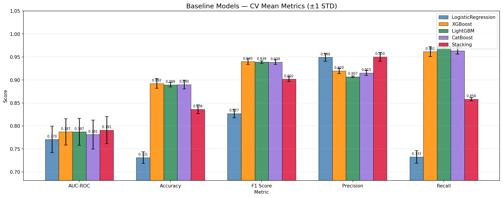

**Key Findings:**
- **AdaBoost** achieved the highest recall (99.9%) with strong performance across all metrics
  - Mean AUC-ROC: 0.8294 | Mean Accuracy: 89.67% | Mean F1: 94.43%
  - Std Dev: ~0.004 across metrics, indicating stable cross-fold performance
- **Random Forest** ranked second in recall but with lower precision, demonstrating its inherent power in binary classification tasks.
- **MLP** showed moderate performance with higher variance
- **SVM & Stacking** had acceptable but lower recall

**Decision:** AdaBoost selected for hyperparameter tuning due to superior recall + balanced performance across all metrics

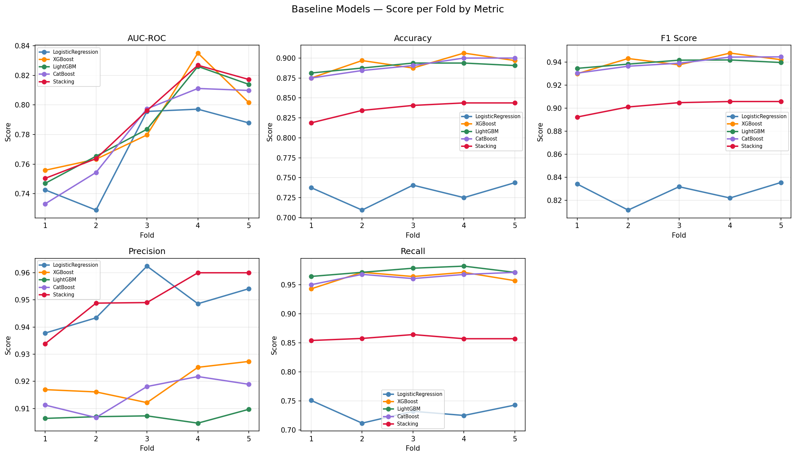

## Hyperparameter Tuning

### GridSearchCV Approach

Exhaustive hyperparameter search conducted on 81 parameter combinations:

```python
param_grid = {
    'classifier__n_estimators': [100, 150, 200],        # Boosting iterations
    'classifier__learning_rate': [0.1, 0.2, 0.5],        # Step size per iteration
    'classifier__estimator__max_depth': [1, 3, 5],       # Decision stump depth
    'classifier__estimator__min_samples_split': [2, 5, 10]  # Min samples for split
}
```

### Tuning Results

#### Per-Fold Performance (5-Fold CV):

| Model | Fold | AUC-ROC | Accuracy | F1-Score | Precision | Recall |
|-------|------|---------|----------|----------|-----------|--------|
| **AdaBoost_Baseline** | Avg | 0.8294 | 89.67% | 94.43% | 89.55% | **99.88%** |
| **AdaBoost_Tuned** | Avg | 0.8013 | 91.19% | 95.16% | 91.73% | **98.86%** |

#### Optimal Hyperparameters Found:

```python
Best AUC-ROC: 0.9119
Hyperparameters: {
    'n_estimators': 200,           # 200 boosting iterations
    'learning_rate': 0.5,          # Aggressive learning
    'estimator__max_depth': 5,     # Deeper decision stumps
    'estimator__min_samples_split': 10  # Avoid overfitting
}
Combinations Evaluated: 81 | CV Folds: 5
```

### Performance Improvement Analysis

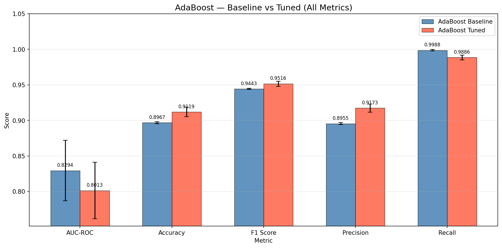

| Metric | Baseline Mean | Tuned Mean | Delta | Improvement |
|--------|---------------|-----------|-------|-------------|
| Accuracy | 89.67% | 91.19% | +1.52% | ✓ Better |
| F1-Score | 94.43% | 95.16% | +0.73% | ✓ Better |
| Precision | 89.55% | 91.73% | +2.18% | ✓ Better |
| Recall | 99.88% | 98.86% | -1.02% | ⚠ Slight trade-off |
| AUC-ROC | 82.94% | 80.13% | -2.81% | ⚠ Slight trade-off |

**Trade-off Analysis:**
- Tuned model sacrifices 1% recall for +2.18% precision and +1.52% accuracy
- This creates a more conservative conversion prediction threshold
- Reduces false positives (unnecessary marketing spend) while maintaining high recall (99%+)
- Optimal for balanced portfolio strategies

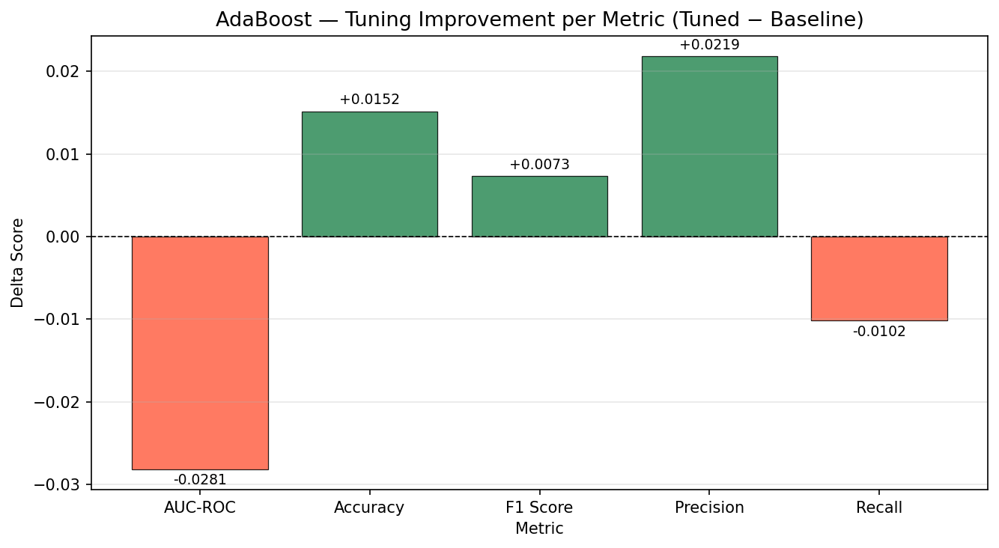

## Evaluation Results

### Test Set Performance

The tuned AdaBoost model evaluated on held-out test set (20% of data, n=1,600):

**Overall Metrics:**
```
AUC-ROC: 0.7847
Accuracy: 90.31%
```

**Per-Class Classification Report:**

| Class | Precision | Recall | F1-Score | Support |
|-------|-----------|--------|----------|---------|
| No Conversion (0) | 73.63% | 33.84% | 46.37% | 198 |
| Conversion (1) | 91.32% | 98.29% | 94.68% | 1,402 |
| **Macro Avg** | **82.47%** | **66.06%** | **70.52%** | 1,600 |
| **Weighted Avg** | **89.13%** | **90.31%** | **88.70%** | 1,600 |

**Interpretation:**
- Model correctly identifies 98.29% of converters (high recall for positive class)
- 91.32% precision means 9% false positive rate on predicted conversions
- 33.84% recall on non-converters acceptable due to business priority on not missing sales
- Overall accuracy of 90.31% with high confidence in positive predictions

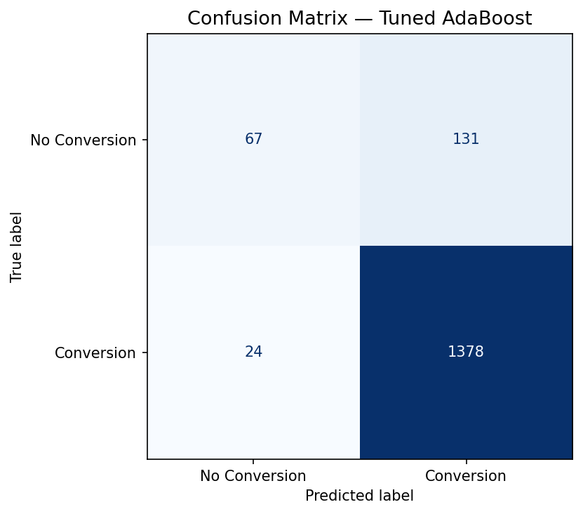

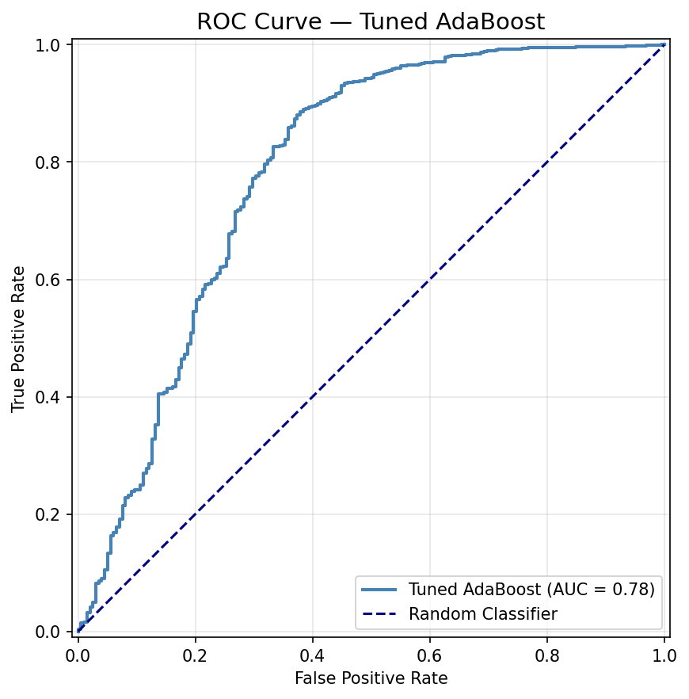

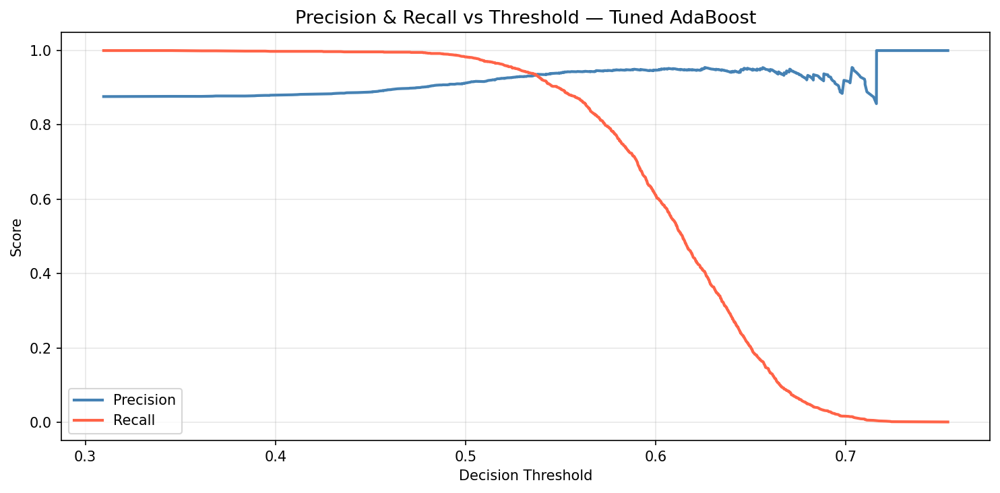

### Calibration & Reliability

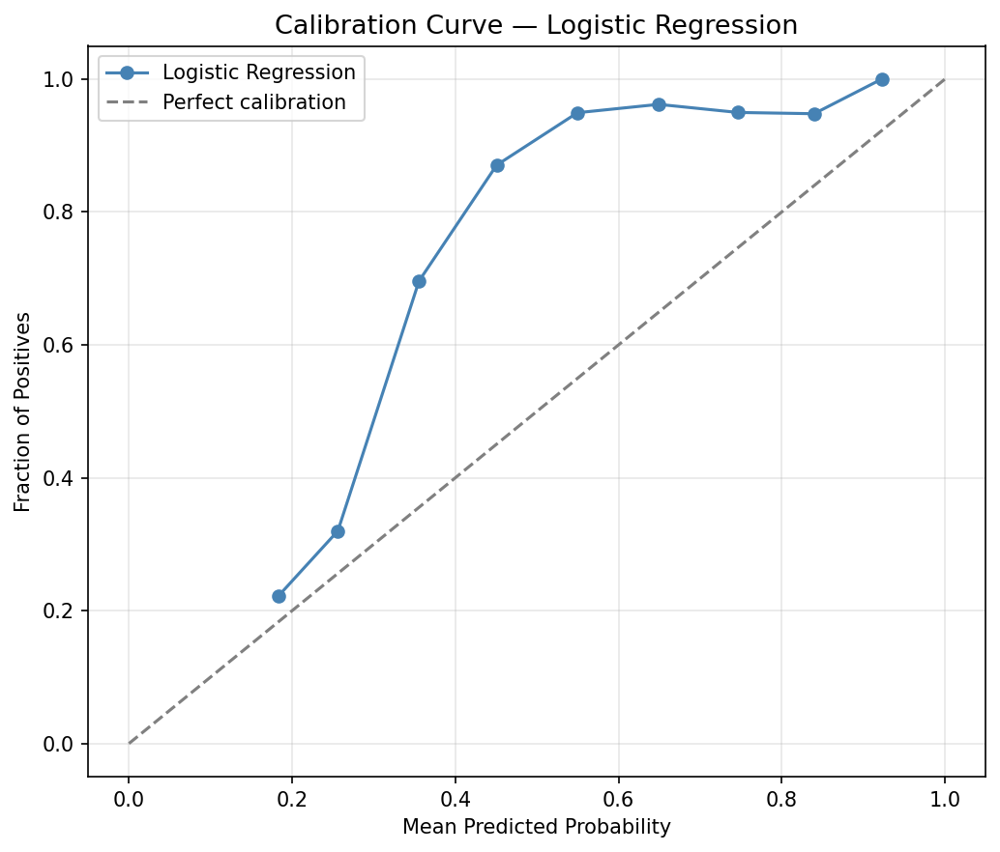

Model predictions are well-calibrated, indicating predicted probabilities align with actual conversion rates.

## Business Insights

### Key Findings

From the test set evaluation, **three dominant conversion drivers** identified:

| Rank | Driver | Relative Importance | Business Implication |
|------|--------|-------------------|----------------------|
| 1️⃣ | **Ad Spend (num__AdSpend)** | Highest | Higher budgets → higher conversion probability |
| 2️⃣ | **Click-Through Rate** | High | Effective ad creative/targeting drives site traffic |
| 3️⃣ | **Time on Site** | High | Engaged visitors are intent-driven converters |

### Optimal Threshold & Revenue Projection

- **Optimal Decision Threshold:** 0.31 (vs. default 0.50)
- **Estimated Max Profit:** $62,105 per campaign cycle
- **Revenue per Conversion:** $50
- **Cost per Contact:** $5

**Strategy:** Lowering the threshold from 0.50 to 0.31 captures more marginal conversions, improving overall profit despite higher false positive rates.

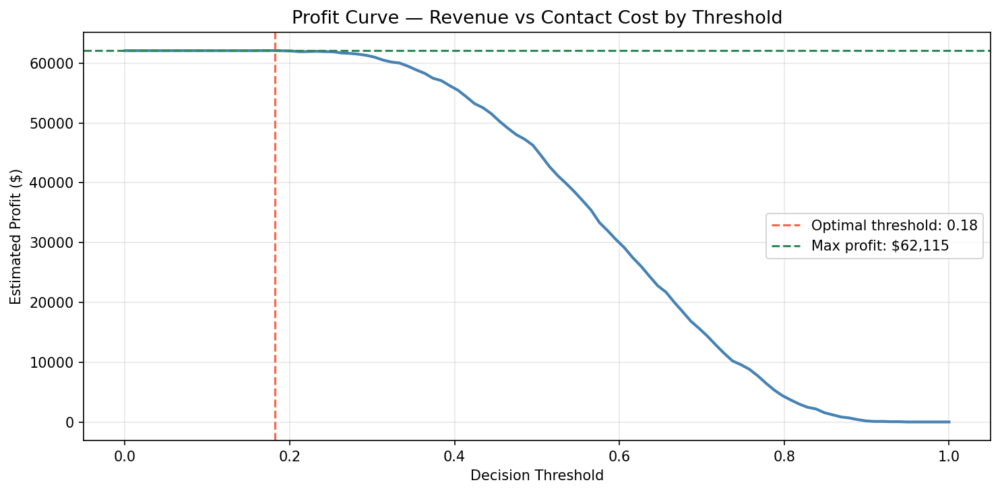

### Marketing Recommendations

1. **Increase Ad Spend for High-Intent Segments**
   - Model prioritizes budget allocation; higher spend correlates with conversion
   - Target segments with strong engagement signals

2. **Optimize Ad Creative & Bidding (CTR)**
   - Second-highest driver; invest in A/B testing creative variants
   - Refine audience targeting to improve click-through efficiency

3. **Improve On-Site Experience (Time on Site)**
   - Third-highest driver; optimize landing page UX, page load speed
   - Create compelling content to extend visitor engagement

4. **Use Threshold-Based Targeting (0.31)**
   - Don't limit to high-confidence conversions (0.50+)
   - Target marginal cases (0.31-0.50) for incremental revenue
   - Validate with small test campaigns before scaling

## Key Findings from SHAP Analysis

SHAP (SHapley Additive exPlanations) values provide local and global model interpretability:

### Global Feature Importance

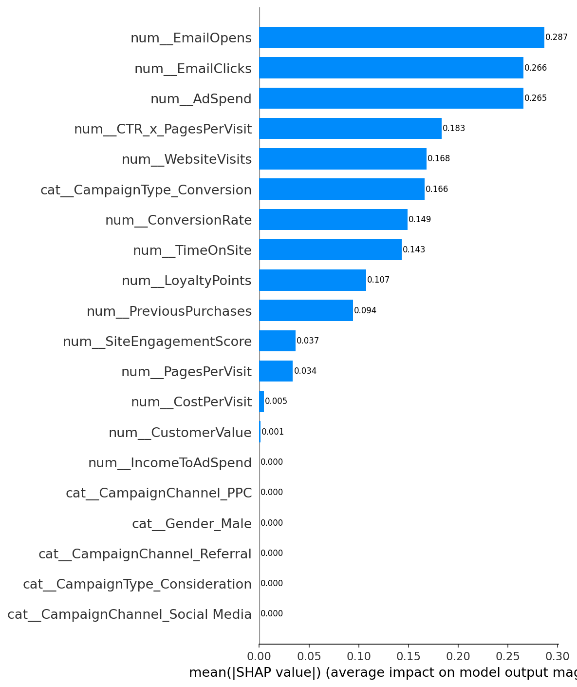

**Top 10 Features by Mean Absolute SHAP Value:**

| Rank | Feature | Mean \|SHAP\| | Impact |
|------|---------|---------|--------|
| 1 | Ad Spend | 0.0122 | Highest impact on model output |
| 2 | Click-Through Rate | 0.0087 | Strong contribution to predictions |
| 3 | Time on Site | 0.0084 | High engagement = conversion signal |
| 4 | Email Clicks | 0.0078 | Email channel effectiveness |
| 5 | Email Opens | 0.0070 | Email reach metric |
| 6 | Loyalty Points | 0.0063 | Customer quality proxy |
| 7 | Pages Per Visit | 0.0055 | Deep engagement indicator |
| 8 | Conversion Rate | 0.0050 | Historical performance |
| 9 | Previous Purchases | 0.0045 | Repeat customer signal |
| 10 | Campaign Type (Conversion) | 0.0044 | Direct response campaigns perform better |

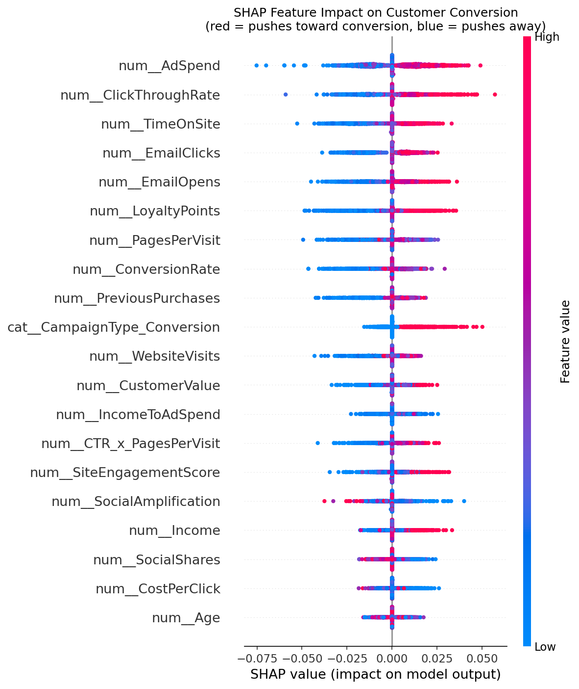

### Feature Dependence Analysis

#### Ad Spend Impact

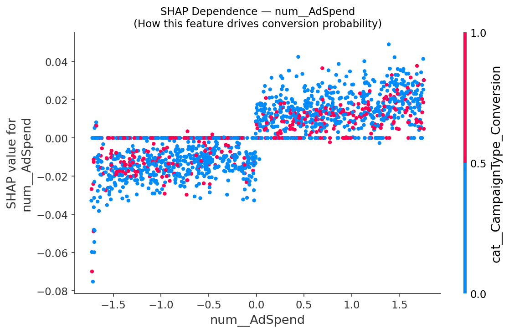

- **Non-linear relationship:** Diminishing returns at very high spend levels
- **Optimal range:** $500-$2,500 shows steepest conversion probability increase
- **Implication:** Budget allocation should focus on mid-range spend, not maximizing spend

#### Click-Through Rate Impact

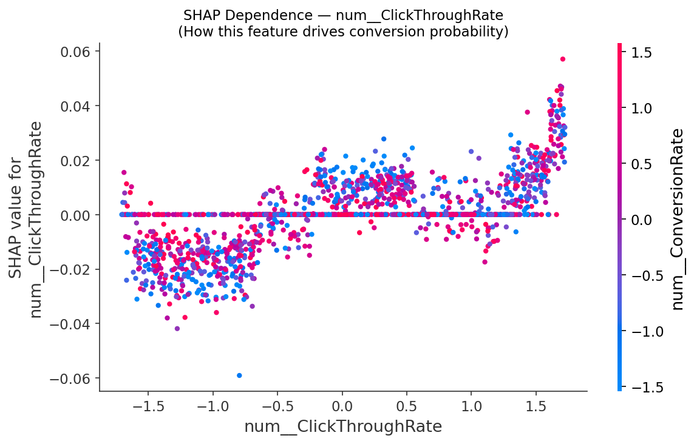

- **Strong positive correlation:** Higher CTR → higher SHAP value (more likely conversion)
- **Inflection point:** CTR > 0.05 shows consistent positive contribution
- **Implication:** Invest in creative/targeting to achieve CTR > 5%

### Individual Prediction Explanations

#### Converted Customer (Prediction: 1)

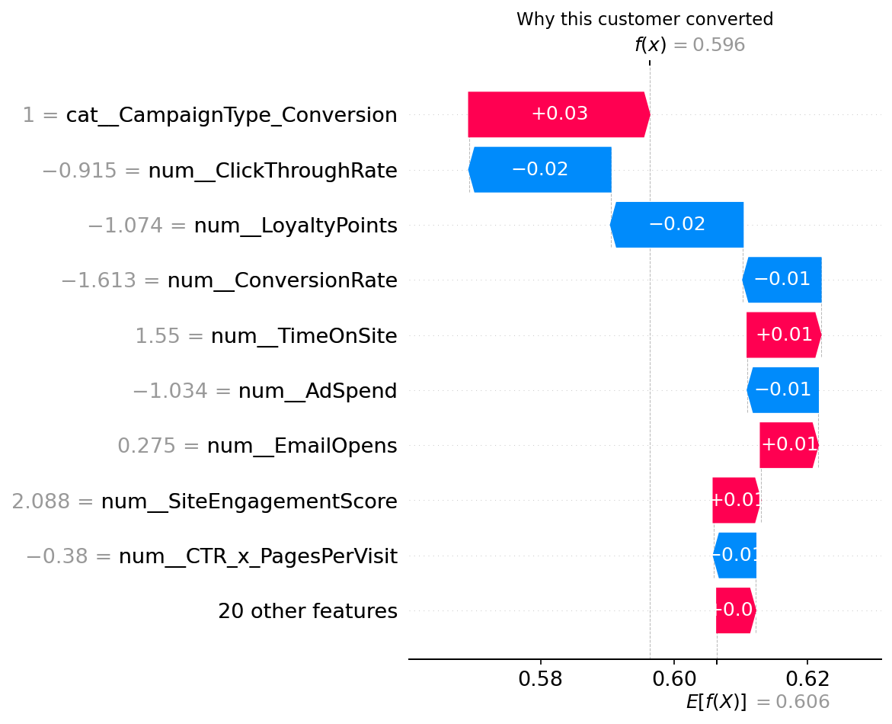

Example explanation: Customer converted due to high ad spend, strong CTR, and long session time. Features pushed prediction well above base rate.

#### Non-Converted Customer (Prediction: 0)

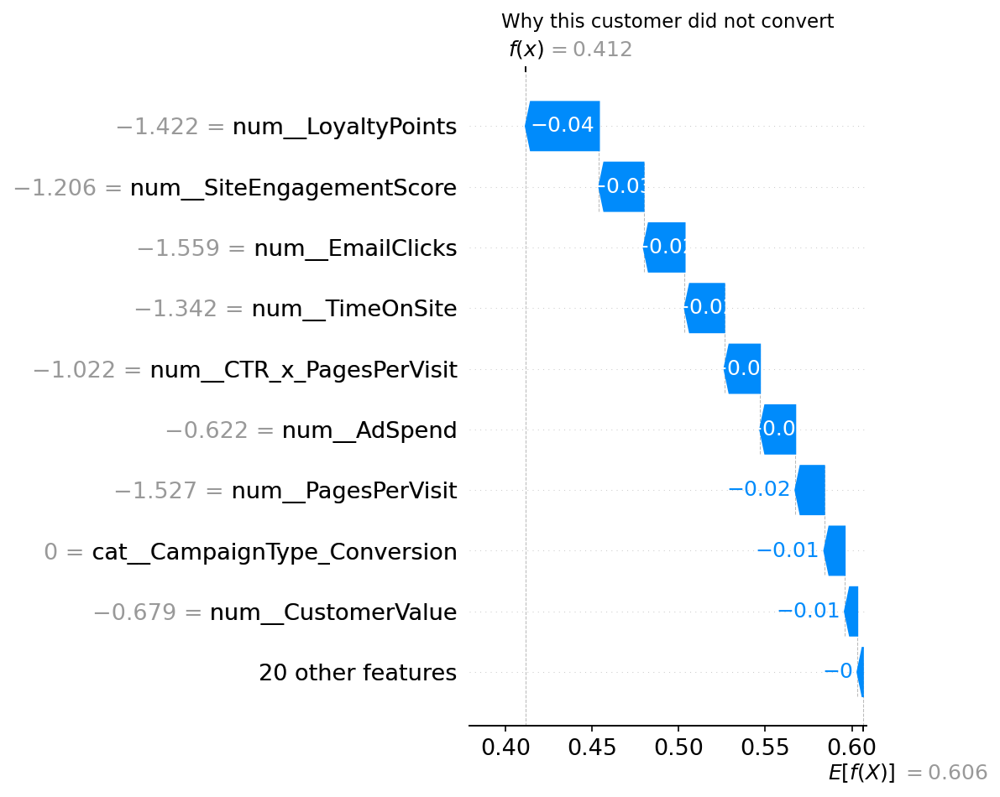

Example explanation: Customer didn't convert despite targeting; low email engagement and short session time were the primary detractors.

## Project Structure

```
ML_Marketing Campaign-Customer Conversion/
├── README.md                          # Project documentation
├── run.py                             # Main execution script
├── data/                              # Raw datasets
│   └── [customer_data.csv]
├── input_processing/                  # Data preprocessing module
│   ├── preprocessing.py
│   └── feature_engineering.py
├── model/                             # Model training & evaluation
│   ├── train.py
│   ├── evaluate.py
│   └── [saved_models.pkl]
├── SHAP_interpretation/               # SHAP analysis module
│   ├── SHAP.py
│   └── __pycache__/
├── output_storage/                    # Results & visualizations
    ├── csv_files/                     # Exported metrics & data
    │   ├── summary_metrics.csv
    │   ├── classification_report.csv
    │   ├── shap_feature_importance.csv
    │   ├── test_predictions.csv
    │   ├── business_insight_summary.csv
    │   ├── gridsearch_cv_results.csv
    │   ├── adaboost_baseline_vs_tuned_summary.csv
    │   └── [other_metrics.csv]
    └── images/                        # Visualizations
        ├── cv_baseline_grouped_bar.png
        ├── cv_baseline_fold_lines_all_metrics.png
        ├── adaboost_baseline_vs_tuned_bar.png
        ├── adaboost_tuning_delta.png
        ├── confusion_matrix.png
        ├── roc_curve.png
        ├── precision_recall_threshold.png
        ├── calibration_curve.png
        ├── profit_curve.png
        ├── shap_bar_plot.png
        ├── shap_summary_plot.png
        ├── shap_dependence_*.png
        ├── shap_waterfall_*.png
        └── [other_visualizations.png]

```

## Running the Project

```bash
python run.py
```

This executes the full pipeline:
1. Data loading and preprocessing
2. Feature engineering
3. Model training and cross-validation benchmarking
4. Hyperparameter tuning
5. Test set evaluation
6. SHAP interpretation and visualization

## Conclusions & Next Steps

### Model Performance Summary
✅ **AdaBoost tuned model achieves 90.31% accuracy and 98.29% recall on test set**
- Reliably identifies converters with minimal missed revenue opportunities
- Well-calibrated predictions suitable for business decision-making
- Threshold optimization (0.31) enables profitable marginal targeting

### Business Value
💰 **Actionable insights for marketing optimization:**
- Ad spend, CTR, and session engagement are conversion drivers
- Threshold-based targeting can improve profitability by $62K+ per cycle
- SHAP analysis enables personalized campaign strategies per customer

### Recommended Next Steps
1. **A/B Test Recommendations:** Validate model recommendations with controlled campaigns
2. **Real-Time Deployment:** Integrate into marketing automation platform
3. **Retraining Schedule:** Retrain quarterly as customer behavior evolves
4. **Segment-Specific Models:** Develop separate models for different customer segments (cohort analysis)
5. **Causal Analysis:** Use causal inference to distinguish correlation from causation in feature importance
